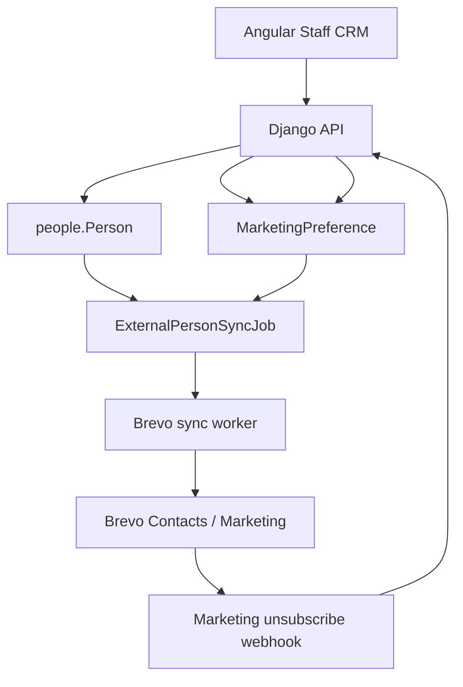

# Elevate MK CRM ↔ Brevo Integration

This is the canonical technical reference for the implemented Elevate MK CRM
integration with Brevo Marketing. It describes the current Django API,
durable synchronization jobs, worker, contact mapping, and inbound marketing
unsubscribe webhook, and read-only Audience Preview. It is not a design for
unimplemented campaign or bidirectional-profile features.

## 1. Purpose and scope

Elevate CRM is the system of record for People, profile data, relationships,
membership/domain data, and marketing consent. Brevo is a communications and
delivery provider. Brevo is not a second CRM and does not become authoritative
for Elevate Person data merely because it contains a contact record.

The implemented marketing integration is intentionally asynchronous:



CRM requests commit CRM state and enqueue durable work; they do not wait for
Brevo HTTP calls. The normal worker is:

```text
python manage.py process_brevo_sync_jobs --watch
```

Brevo transactional email, implemented under `notifications/`, is logically
separate from marketing contact synchronization and remains unchanged.

Mailchimp is frozen as a rollback/reference provider. `MAILCHIMP` jobs and
references are not consumed by the automatic Brevo worker, and no new
Mailchimp functionality is described here.

## 2. Systems of record and authority boundaries

| Data or operation | Authoritative owner | Implemented direction |
| --- | --- | --- |
| Person identity | Elevate `people.Person` | Elevate → Brevo profile fields |
| `primary_email` | Elevate CRM | Used as contact identity; email migration is conservative |
| `first_name`, `last_name` | Elevate CRM | Elevate → `FIRSTNAME`, `LASTNAME` |
| `mobile` | Elevate CRM | Elevate → `SMS` only when safely representable |
| Relationships, membership, events, tickets, professional data | Elevate CRM/domain apps | Not synchronized by this integration |
| EMAIL marketing consent | Elevate `MarketingPreference` | Elevate → Brevo marketing behavior |
| Brevo contact identity | Brevo numeric contact ID, linked in `ExternalPersonReference` | Used by Elevate for safe updates |
| Provider delivery/restrictive state | Brevo | Read and protected; not imported as CRM consent |
| Brevo marketing unsubscribe | Brevo provider event | Brevo → CRM `EMAIL=OPTED_OUT` |

Profile synchronization is one-way. Editing `FIRSTNAME`, `LASTNAME`, or `SMS`
directly in Brevo does not overwrite the Elevate Person. The only currently
implemented provider-to-CRM marketing outcome is the authenticated Brevo
marketing unsubscribe webhook, which records CRM opt-out evidence.

## 3. Domain models

### `Person`

`people.Person` is the canonical CRM human identity. Marketing profile fields
used by this integration are `primary_email`, `first_name`, `last_name`, and
`mobile`. People also carry CRM-only fields such as location, demographics,
archive state, membership relationships, and other domain data.

### `MarketingPreference`

`marketing_preferences.MarketingPreference` stores the current provider-neutral
preference for a Person and channel. The implemented channel is `EMAIL`, with
states:

- `UNKNOWN` — no explicit preference row exists;
- `OPTED_IN` — explicit permission is recorded;
- `OPTED_OUT` — explicit negative preference is recorded.

`UNKNOWN` is not an opt-out, but it is not eligible to create or subscribe a
Brevo marketing contact. Person existence, membership, or an available email
address does not imply consent.

### `MarketingPreferenceHistory`

`MarketingPreferenceHistory` is append-only evidence of meaningful explicit
preference recordings. Repeating the same state, source, and actor is
idempotent and does not create another meaningful history row. A meaningful
change transactionally creates a provider-neutral sync job through the
authoritative preference service.

### `ExternalPersonReference`

`external_references.ExternalPersonReference` links a BUSINESS Person to a
provider identity. For Brevo marketing the stable mapping is:

```text
provider       = BREVO
reference_type = MARKETING_CONTACT
external_id    = Brevo numeric contact ID
```

It is not an email mapping. Active/revoked lifecycle state is retained, and
the model enforces uniqueness both for a provider contact identity and for a
Person/provider/reference-type combination. Identity conflicts fail safely;
profile synchronization does not create, revoke, or casually move references.

### `ExternalPersonSyncJob`

`external_references.ExternalPersonSyncJob` is the durable queue record. It
stores the Person, provider, job type, source event ID, status, availability,
attempt count, lock/completion timestamps, and bounded safe error details.

Brevo job types currently supported by the automatic worker are:

```text
EMAIL_MARKETING_PREFERENCE
PERSON_PROFILE
```

Statuses are `PENDING`, `PROCESSING`, `SUCCEEDED`, and `FAILED`. Jobs are
claimed transactionally with database row locking. A pending profile job for
the same Person is coalesced; the worker reads current Person state instead of
using a stored profile snapshot. Completed jobs are not mutated for coalescing.

### `MarketingWebhookReceipt`

`marketing_preferences.MarketingWebhookReceipt` stores bounded handling
evidence for a provider webhook. Its replay key is an `event_fingerprint`,
not the Brevo payload `id`. It stores provider, event type, optional Person,
event time, list context, campaign ID, outcome, and receipt time. Raw webhook
payloads and raw recipient email addresses are not stored.

## 4. Brevo configuration

Settings are loaded from the backend environment in `config/settings.py`.

| Variable | Purpose | Default / requirement | Process use |
| --- | --- | --- | --- |
| `BREVO_API_KEY` | Brevo API authentication | Empty by default; required for Brevo API operations | Worker, manual/diagnostic marketing commands, and transactional Brevo operations |
| `BREVO_MARKETING_LIST_ID` | Initial marketing list and optional webhook list scope | Empty by default; must be a positive integer for list-based sync and supplied-list webhook validation | Worker and webhook web process |
| `MARKETING_SYNC_PROVIDER` | Active marketing provider selector | `BREVO`; unsupported values fail checks/runtime | Web and worker |
| `BREVO_MARKETING_WEBHOOK_USERNAME` | Inbound webhook Basic Auth username | Empty by default; required to accept webhook traffic | Web process |
| `BREVO_MARKETING_WEBHOOK_PASSWORD` | Inbound webhook Basic Auth password | Empty by default; required to accept webhook traffic | Web process |
| `BREVO_SYNC_WORKER_POLL_SECONDS` | Idle worker polling interval | Positive value; default `3.0` seconds | Worker |
| `BREVO_SYNC_WORKER_BATCH_SIZE` | Maximum jobs claimed per polling batch | Positive value; default `20`, capped at `100` by worker validation | Worker |

`BREVO_API_KEY` is an API credential and is never printed, persisted in
references, or included in operational output. Webhook Basic credentials are
separate inbound credentials configured both in the Elevate web environment
and in Brevo's outbound webhook configuration. They must not be committed,
embedded in a URL, or logged.

The web process needs the webhook credentials to receive inbound events. The
worker needs the API key and marketing list configuration to synchronize
contacts. Deployment may scope webhook credentials to the web service rather
than exposing them to the worker.

## 5. Brevo contact schema

The deliberately minimal supported mapping is:

```text
Person.primary_email -> Brevo email identity
Person.first_name    -> FIRSTNAME
Person.last_name     -> LASTNAME
Person.mobile        -> SMS when safely representable
```

The integration intentionally does not synchronize address, city, postcode,
membership status/number, Eventbrite data, ticket/barcode data, CRM Person ID,
job title, LinkedIn, WhatsApp, `LANDLINE_NUMBER`, Brevo `OPT_IN`, notes, tags,
segments, or other unrelated attributes. Keeping the contact schema small
reduces accidental authority leakage and provider-specific coupling.

## 6. Mobile number handling

The current helper in `people.services.normalize_mobile` removes common visual
separators only. Brevo synchronization then accepts a value only when it is
already internationally representable:

- a `+` prefix followed by 7–15 digits; or
- a `00` prefix followed by 7–15 digits.

For example, the formatting-only transformation:

```text
+44 7911 123456 -> +447911123456
```

is safe because the country code is already present. Ambiguous local values
such as `0991000001` are not assigned a country and are omitted from the SMS
payload. Blank mobile values are represented as an empty `SMS` attribute during
profile synchronization so stale provider SMS data is cleared. Unsafe mobile
values are omitted without failing a name/profile update. Mobile presence does
not imply SMS consent or EMAIL marketing consent.

Full country-aware E.164 normalization is not implemented. The future TODO is
to normalize known-country numbers safely before synchronization; the system
must not convert every leading `0` to `+44` because Elevate may contain people
from multiple countries.

## 7. Marketing consent flow: CRM → Brevo

The consent flow is:

```text
Staff/API preference change
    -> MarketingPreference
    -> MarketingPreferenceHistory
    -> BREVO ExternalPersonSyncJob
    -> process_brevo_sync_jobs --watch
    -> Brevo Contacts API
```

The preference transaction does not perform a Brevo HTTP request. The worker
re-reads current CRM consent and profile state when it processes the job.

### `UNKNOWN`

No Brevo marketing contact is created or subscribed. A preference job may
complete with `SKIPPED_CONSENT_UNKNOWN`.

### `OPTED_IN`

If no contact exists and the Person is an eligible active BUSINESS Person with
a usable primary email, the normal consent sync can create a contact with
`status` represented by Brevo contact/list behavior and the configured list.
Existing contacts can receive the approved profile attributes and list
membership when not protected. Restrictive provider state is never cleared by
CRM opt-in. Relevant outcomes include `CREATED_MARKETING_CONTACT`,
`UPDATED_MARKETING_CONTACT`, `ALREADY_SYNCHRONIZED`, and
`SKIPPED_PROTECTED_PROVIDER_STATE`.

### `OPTED_OUT`

An absent contact is not created. An existing unprotected contact can be
placed into Brevo's email-campaign restrictive state; an already blocklisted
contact is treated idempotently, and stronger list-unsubscribe/protected
states are not weakened. Relevant outcomes include `MARKETING_OPTED_OUT`,
`ALREADY_MARKETING_OPTED_OUT`, and `SKIPPED_CONSENT_OPTED_OUT_NO_CONTACT`.

## 8. Restrictive provider state and anti-resubscription safety

CRM `OPTED_IN` means Elevate considers the Person eligible from the CRM
consent perspective. It does not authorize clearing provider-level
restrictions. The integration protects Brevo `emailBlacklisted` and
`listUnsubscribed` state, does not automatically resubscribe contacts, and
does not add a profile-only contact back to a marketing list.

Profile updates are attribute-only and are allowed for an existing referenced
contact even when CRM consent is `OPTED_OUT`; correcting a surname must not
change marketing eligibility. Brevo's update-contact documentation warns that
changing a blocklisted contact's email can remove blocklisting and resubscribe
the contact, which is why this integration does not blindly update provider
email identity. See the [Brevo Update Contact API](https://developers.brevo.com/reference/update-contact).

## 9. Brevo unsubscribe flow: Brevo → CRM

The implemented inbound flow is:

```text
Brevo marketing unsubscribe
    -> outbound webhook
    -> POST /api/v1/webhooks/brevo/marketing/
    -> HTTP Basic Auth
    -> payload validation and list-scope handling
    -> exact BUSINESS Person resolution
    -> MarketingPreference EMAIL=OPTED_OUT, source=BREVO
    -> MarketingPreferenceHistory and audit evidence
    -> MarketingWebhookReceipt
```

The real campaign unsubscribe shape observed and supported includes fields such
as `id`, `camp_id`, `email`, `campaign name`, `date_sent`, `date_event`, `tag`,
`event`, `ts`, `ts_event`, and `ts_sent`. Real campaign unsubscribe payloads
may omit `list_id`.

Current validation behavior:

- `event` must be `unsubscribe`; other marketing events are acknowledged as
  unsupported without consent mutation;
- `email` must be valid after CRM email normalization;
- absent `list_id` is allowed when reliable timestamp evidence exists;
- when `list_id` is supplied, it must be a valid list-ID array containing the
  configured `BREVO_MARKETING_LIST_ID`;
- no list ID is fabricated or inferred;
- list-less events require `ts_event`, `ts`, or a valid `date_event` for safe
  event evidence/fingerprinting.

An exact single BUSINESS Person is resolved by normalized primary email. A
valid unsubscribe records `EMAIL=OPTED_OUT` with source `BREVO`; it does not
create a Person or alter an existing Brevo reference.

## 10. Webhook authentication

The endpoint uses HTTP Basic authentication implemented in
`brevo_marketing.webhooks.authenticate_webhook_request`. The same username and
password must be configured in the Elevate backend environment and Brevo's
outbound webhook configuration.

The endpoint returns:

- `401` for missing/invalid credentials;
- `503` when webhook credentials or required list configuration is unavailable;
- `400` for invalid JSON, malformed payloads, invalid email/list/timestamp
  evidence, or conflicting supplied list scope;
- `200` with `UNSUPPORTED_EVENT` for valid but unsupported event types;
- `200` for accepted, replayed, missing-Person, or identity-conflict outcomes;
- `500` for unexpected processing failures so the provider can retry.

Credentials are never included in URLs, responses, audit metadata, receipts,
or logs.

## 11. Webhook identity resolution

Webhook resolution uses only an exact normalized `BUSINESS` Person
`primary_email` match. It does not use names, phones, fuzzy matching, or
Person creation. No match is acknowledged safely as `PERSON_NOT_FOUND`.
Multiple matches produce `IDENTITY_CONFLICT` without changing consent.

The unsubscribe payload does not provide a stable Brevo contact ID suitable for
creating an `ExternalPersonReference`. Existing `BREVO/MARKETING_CONTACT`
references are preserved; the webhook does not invent or move one.

## 12. Webhook replay protection

Brevo's marketing webhook `id` is the internal webhook ID, not a globally
unique event ID. It is therefore never used alone as a receipt key.

When reliable event time exists, the fingerprint is derived from:

- event type;
- SHA-256 digest of normalized recipient email;
- campaign ID when present;
- event timestamp;
- sorted list IDs when present;
- webhook ID only as an additional non-unique component.

The raw email is not stored in `MarketingWebhookReceipt`. An exact repeated
delivery produces `REPLAY_IGNORED`. Different recipients cannot collide merely
because the webhook ID is the same, and a later unsubscribe after re-consent
can be processed when its campaign/timestamp evidence differs.

## 13. Loop prevention

Provider-originated unsubscribe processing calls the authoritative preference
service with `origin_provider=BREVO`. The CRM preference, history, and audit
evidence are still written, but the preference service suppresses creation of
the outbound BREVO echo job. Thus:

```text
Brevo unsubscribe -> CRM OPTED_OUT
```

does not become an unnecessary:

```text
CRM OPTED_OUT -> new BREVO synchronization job
```

## 14. Person profile synchronization

`PERSON_PROFILE` jobs are created in the authoritative `PersonDetailView.patch`
path after a successful Person update. Only changes to `primary_email`,
`first_name`, `last_name`, or `mobile` trigger them. Unrelated changes and
identical saves do not. A pending profile job for that Person is reused rather
than accumulating duplicate pending work. Jobs store no profile PII snapshot;
the worker reads the current Person.

Profile synchronization requires an active Brevo marketing
`ExternalPersonReference`. It never creates a contact or reference merely
because a Person's name or mobile changed. Without a reference it completes
normally as `SKIPPED_NO_MARKETING_CONTACT`.

For an existing safely identified contact it updates only `FIRSTNAME`,
`LASTNAME`, and `SMS`. Empty supported values are sent as empty attributes to
clear stale provider data. A safe international mobile is sent as `SMS`;
unsafe mobile is omitted and returns the safe reason
`MOBILE_OMITTED_UNSAFE_FORMAT`. Profile synchronization never changes
MarketingPreference, consent, list membership, blocklisting, or list-unsubscribe
state. Successful updates use `UPDATED_PERSON_PROFILE`.

## 15. Email identity changes and reconciliation

Email is higher risk than names or mobile. Profile synchronization resolves by
the existing stable Brevo contact ID, then verifies that the current valid CRM
email matches the referenced provider contact. It does not use a new email to
search for a replacement contact and does not send `EMAIL` in a profile
attribute update.

If the contact is missing, the CRM email is invalid, or CRM/provider email
identity differs, the result is `RECONCILIATION_REQUIRED`. The system does not
fuzzy-match, use `forceMerge`, create a duplicate, silently move a reference,
or perform an automatic email migration that could weaken provider
restrictions.

## 16. Automatic Brevo worker

Start the worker once:

```text
python manage.py process_brevo_sync_jobs --watch
```

It continuously claims eligible `BREVO` jobs of type
`EMAIL_MARKETING_PREFERENCE` or `PERSON_PROFILE`, in bounded batches. The
default idle poll interval is three seconds and the default batch size is 20,
with a maximum validated batch size of 100. Empty polls wait rather than
busy-looping. A job failure is recorded and does not terminate the worker
loop.

Claims use the existing database transaction and `select_for_update()` row
locking. Processing locks older than 15 minutes are recovered as pending. The
worker handles SIGINT/SIGTERM and leaves durable job state valid during
shutdown. Safe operational output includes provider, job ID, status,
attempts, outcome, and error code; credentials and unnecessary PII are not
logged.

Mailchimp jobs are never selected by this worker. Transactional Brevo email is
also not processed by this queue.

One-shot mode remains available for diagnostics or controlled operations:

```text
python manage.py process_brevo_sync_jobs --limit 10
```

It is not the normal production operating mode.

## 17. Retry and failure classification

The worker preserves the existing durable retry model. Temporary network and
timeout failures, HTTP 429/rate limits, and Brevo 5xx failures are requeued
with bounded backoff until the job's `max_attempts` is reached. `available_at`
prevents a retry from being claimed before its delay.

Configuration, authentication/access, validation, identity conflicts, and
reconciliation-required outcomes are terminal or safe business outcomes.
Normal outcomes such as no consent, no marketing contact for a profile job,
protected provider state, and already-synchronized state are completed rather
than retried. Stored error messages are bounded and sanitized.

## 18. Local development

Normal local operation uses two terminals:

```text
Terminal 1: python manage.py runserver
Terminal 2: python manage.py process_brevo_sync_jobs --watch
```

For inbound webhook testing, a third terminal can expose the local server:

```text
Terminal 3: cloudflared tunnel --url http://localhost:8000
```

The temporary tunnel URL changes when the tunnel restarts, so the Brevo
webhook URL must be updated accordingly. Basic Auth remains required. The
endpoint path is:

```text
/api/v1/webhooks/brevo/marketing/
```

## 19. Brevo webhook configuration

The implemented Brevo UI configuration is conceptually:

```text
Type:             Outbound webhook
Event category:   Marketing email
Event:            Unsubscribed only
Authentication:   Basic authentication
Endpoint path:    /api/v1/webhooks/brevo/marketing/
```

Only the marketing unsubscribe event is consumed. Delivered, opened, clicked,
bounced, transactional, SMS, and other provider events are not treated as
implemented CRM-consent inputs.

## 20. Production and Railway deployment

The intended deployment separates web and worker processes:

```text
Railway WEB service
    -> Django API and Brevo webhook endpoint

Railway WORKER service
    -> python manage.py process_brevo_sync_jobs --watch
```

Both use the same application code and database. The worker requires the
Brevo API key, marketing list ID, and `MARKETING_SYNC_PROVIDER=BREVO`. Webhook
Basic credentials are principally required by the WEB service. The repository
documents this start command; a separate Railway worker service must still be
created/configured operationally if it does not already exist. This document
does not claim that deployment infrastructure is automatically provisioned.

## 21. Management and diagnostic commands

| Command | Purpose |
| --- | --- |
| `python manage.py inspect_brevo_marketing` | Read-only marketing contact attribute/list inspection; diagnostic |
| `python manage.py sync_brevo_marketing_person <person_id>` | Controlled one-Person marketing synchronization; manual |
| `python manage.py process_brevo_sync_jobs --limit 10` | Bounded one-shot queue processing; operational/debug |
| `python manage.py process_brevo_sync_jobs --watch` | Continuous normal Brevo worker |

The commands do not print API keys or webhook credentials. The one-Person
command reports safe outcome/contact-reference metadata and is not bulk sync.

## 22. Security and privacy

- API keys and webhook credentials are environment-only.
- Webhook credentials are not embedded in endpoint URLs.
- Provider responses are not stored wholesale.
- Webhook receipts store an email digest only through the fingerprint and do
  not store raw recipient email.
- Operational logging uses safe IDs/statuses/outcomes/error codes.
- The Brevo profile is intentionally minimal.
- Membership, event, ticket, CRM-ID, address, and unrelated Person data are
  not pushed to Brevo.
- Provider restrictive state is not silently weakened by CRM opt-in or profile
  edits.

## 23. Tested and proven integration behavior

Automated focused tests exist under `brevo_marketing/tests.py` and
`people/tests.py` for client behavior, consent synchronization, profile
mapping, worker processing, coalescing, webhook authentication/replay, and
provider isolation. The pre-staging hardening checkpoint runs the accumulated
backend and frontend suites before release.

The implemented paths cover the following behaviors:

- manual Brevo contact creation and repeated-sync idempotency;
- CRM opt-out applying provider marketing restriction;
- CRM opt-in not overriding restrictive provider state;
- automatic durable worker processing;
- Brevo campaign unsubscribe returning an accepted HTTP response;
- webhook unsubscribe recording CRM `OPTED_OUT` with source `BREVO`;
- durable webhook receipt/replay protection;
- no outbound Brevo echo job from a provider-originated unsubscribe;
- profile surname/name updates through `PERSON_PROFILE`;
- safe international mobile mapping to `SMS`;
- blank mobile clearing through an empty `SMS` attribute;
- unsafe mobile omission without failing profile name synchronization.

These are implemented behaviors, not a claim of a production deployment or a
specific live contact/account result. Manual live validation should use a
controlled existing Brevo contact and test surname/mobile before testing any
email identity change.

## 24. Known limitations and TODOs

### Phone normalization

Full country-aware E.164 normalization is not implemented. Ambiguous local
numbers are omitted rather than guessed. Future work should use authoritative
country information and must not blanket-convert a leading zero to `+44`.

### Email reconciliation

Email identity migration remains deliberately conservative and requires manual
reconciliation when the current CRM email does not match the referenced Brevo
contact.

### Inbound provider events

Only the explicitly implemented Brevo marketing unsubscribe event is consumed.
Opens, clicks, deliveries, bounces, transactional events, and engagement
analytics are not inbound CRM integrations.

### Audience and campaign functionality

Audience selection/preview is implemented as a read-only, provider-neutral
backend and Staff CRM workflow. Bulk audience synchronization, saved segments,
campaign workflows, tags, journeys, and background campaign automation are not
implemented by this integration.

### Deployment

The application provides the worker command, but creating and sizing a
separate Railway worker service remains a deployment action.

### Mailchimp

Mailchimp remains a frozen rollback/reference implementation and is not the
active automatic marketing provider.

## 25. Future integration roadmap

The following are non-implemented future milestones:

1. Bulk Brevo audience/list synchronization.
2. CRM campaign workflow integration.
3. Additional provider outcome webhooks where justified.
4. Country-aware E.164 mobile normalization.
5. Operational reconciliation and admin tooling where needed.

## Audience selection and read-only preview

Backend Audience Selection & Preview V1 is implemented as a stateless,
provider-neutral read-only operation:

```text
POST /api/v1/marketing/audiences/preview/
```

It reuses the canonical People directory selection semantics for `q`,
`relationship`, `location`, `industry`, `career_stage`, `interest`, `skill`,
and `tag`. Preview is restricted to active BUSINESS People. Archived and
TECHNICAL People never enter the selected population, and preview does not
accept archived/all record-state selection.

Selection and eligibility are separate. The backend classifies each selected
Person using CRM data only:

```text
ELIGIBLE
EXCLUDED_NO_EMAIL
EXCLUDED_OPTED_OUT
EXCLUDED_CONSENT_UNKNOWN
```

The primary exclusion precedence is deterministic:

1. missing email;
2. opted out;
3. unknown consent.

This gives each selected Person exactly one classification and prevents
double-counting. The response provides `selected_count`, `eligible_count`,
`excluded_count`, per-reason exclusion counts, normalized active selection
criteria, and a database-paginated result view (`all`, `eligible`, or
`excluded`). Aggregate counts are calculated over the full selected queryset
and remain unchanged by result view or page.

The preview response exposes only the normal staff-visible Person identity
fields needed for identification, plus classification and exclusion reason.
It does not expose provider IDs or provider responses.

Preview performs no Brevo or Mailchimp requests and does not create or mutate
People, preferences, preference history, webhook receipts, external
references, synchronization jobs, audit events, audience definitions, or
snapshots. Provider restrictive state remains a synchronization/deliverability
concern rather than CRM eligibility.

The selection and eligibility service is intentionally reusable by a future
bulk Brevo synchronization operation. A future bulk operation must re-evaluate
the current CRM state immediately before creating provider work rather than
treating a prior preview as an immutable consent decision. The Staff CRM
Audience Preview UI is implemented; bulk sync, campaign, saved audience, and
snapshot workflows remain out of scope.

## Related documentation

- [Staff CRM frontend guide](../../elevate-mk-crm/docs/brevo-crm-frontend-guide.md)
- [Staff business and operations guide](../../elevate-mk-crm/docs/brevo-crm-business-guide.md)
- [Provider-neutral external references](external-references.md)
- [Provider-neutral marketing consent](marketing-consent.md)
- [Deployment and operations](DEPLOYMENT.md)
- [Brevo marketing webhook documentation](https://developers.brevo.com/docs/marketing-webhooks)
- [Brevo secure webhook calls](https://developers.brevo.com/docs/secured-webhooks)
- [Brevo update contact API](https://developers.brevo.com/reference/update-contact)
